# User Flow Documentation - Hapa Task Manager

## 1. Overview

This document outlines the core user flows within the Hapa Task Manager application, providing detailed step-by-step processes from task creation through completion. These flows are designed to be intuitive while supporting the unique aspects of Hapa's consul-based governance and future integrations.

## 2. Task Creation and Approval Flow

### 2.1 Task Proposal

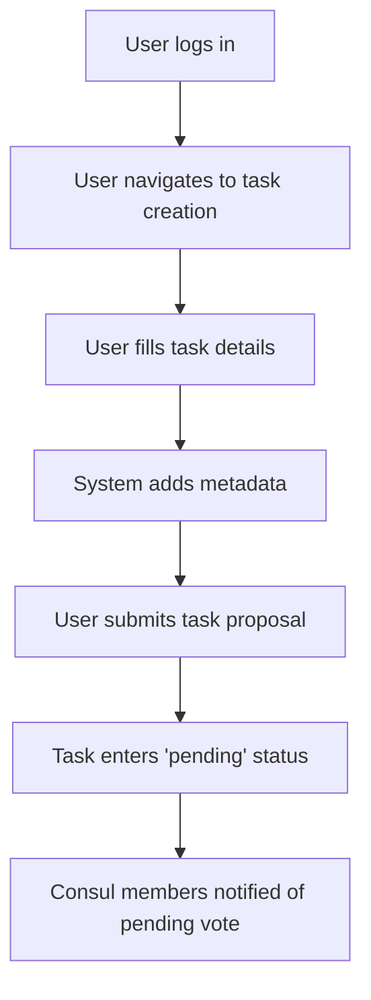

1. User logs into the Hapa Task Manager application
2. User navigates to the task creation interface via the "+" button
3. User completes the task creation form:
   - Title (required)
   - Description (required, supports Markdown)
   - Due date (optional)
   - Priority (required: low/medium/high)
   - Tags (optional)
   - Assignees (optional)
4. System automatically adds metadata:
   - Creator DID
   - Timestamp
   - Consul ID
5. User submits the task proposal
6. Task enters "pending" status
7. Other Consul members receive notification of task requiring vote

### 2.2 Consul Voting Process

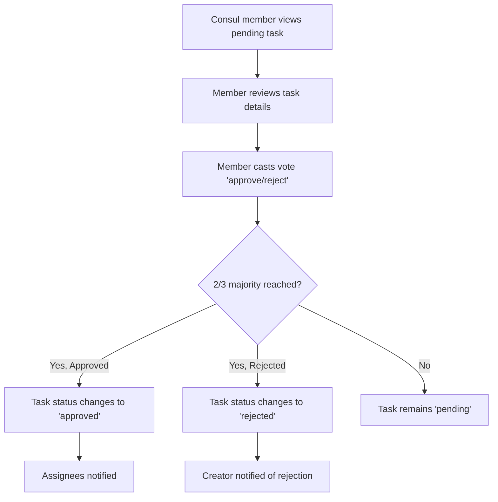

1. Consul members view pending task
2. Members review task details
3. Each member casts "approve" or "reject" vote
4. System tracks voting status
5. When 2/3 majority is reached:
   - If approved: Task status changes to "approved"
   - If rejected: Task status changes to "rejected"
6. For approved tasks:
   - Assignees are notified
   - Task appears in relevant task lists
7. For rejected tasks:
   - Creator is notified with reason (if provided)
   - Task is archived (remains visible to creator)

## 3. Task Execution Flow

### 3.1 Task Management

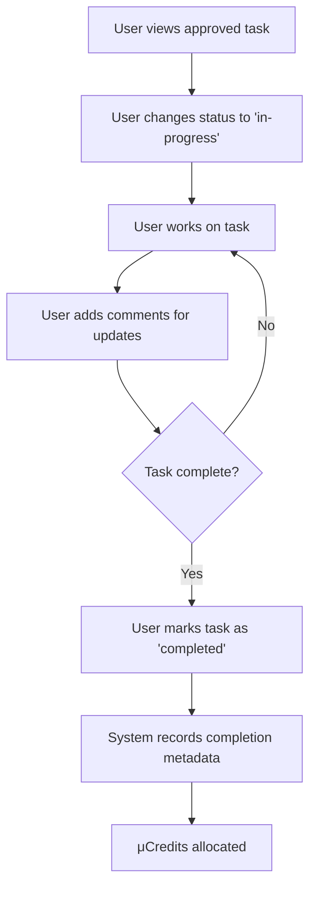

1. Assigned user views the approved task
2. User changes task status to "in-progress"
3. While working on the task:
   - User can add comments with updates
   - User can attach relevant information
   - User can @mention others for attention
4. When finished, user marks task as "completed"
5. System records completion metadata
6. μCredits are allocated based on task value

### 3.2 Task Review Process

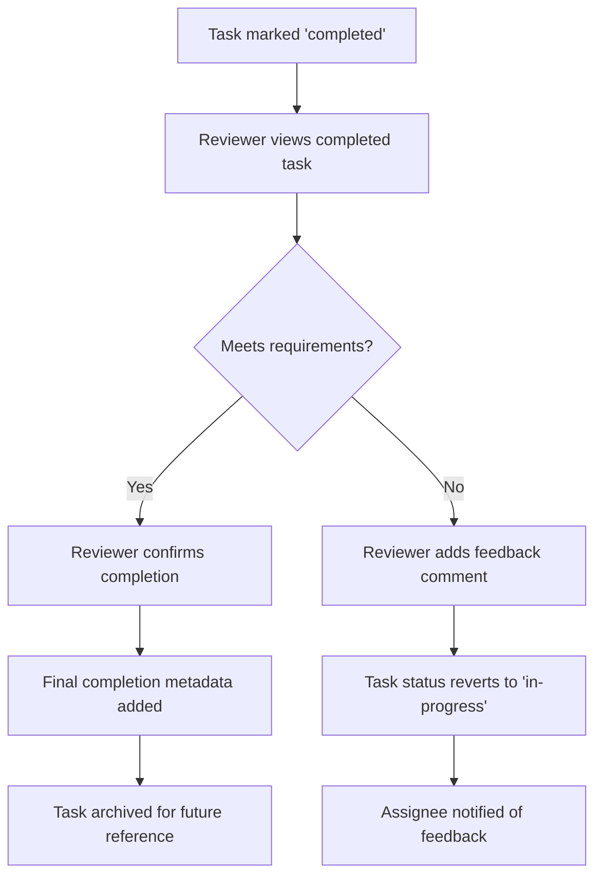

1. Completed task is visible to consul members
2. Reviewer examines the task outputs
3. If task meets requirements:
   - Reviewer confirms completion
   - Final completion metadata is added
   - Task is archived for future reference
4. If task does not meet requirements:
   - Reviewer adds feedback comment
   - Task status reverts to "in-progress"
   - Assignee is notified of feedback

## 4. Task Viewing and Filtering Flow

### 4.1 Accessing Task Lists

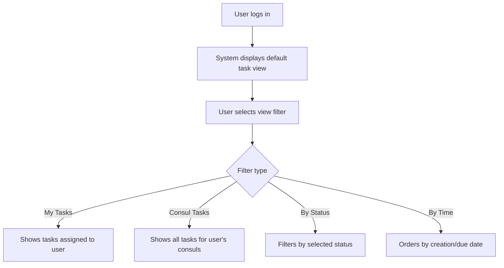

1. User logs in to the application
2. System displays the default task view based on user preferences
3. User can select different view filters:
   - "My Tasks" - tasks assigned to the user
   - "Consul Tasks" - all tasks for the user's consuls
   - "Pending Votes" - tasks requiring user's vote
   - "Completed" - finished tasks
4. User can further refine the list:
   - By status (pending, approved, in-progress, completed)
   - By priority (high, medium, low)
   - By date (creation date, due date)
   - By consul (if user belongs to multiple)

### 4.2 Task Detail Interaction

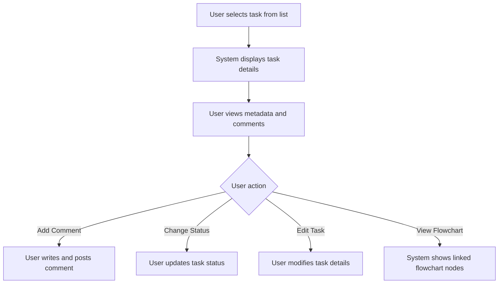

1. User selects a task from the list
2. System displays comprehensive task details:
   - Title and description
   - Status and metadata
   - Voting history
   - Comment thread
   - Flowchart links (if any)
3. User can interact with the task:
   - Add comments to the discussion
   - Update task status (if authorized)
   - Edit task details (if authorized)
   - View linked flowchart nodes (future integration)

## 5. Commenting System Flow

### 5.1 Adding and Responding to Comments

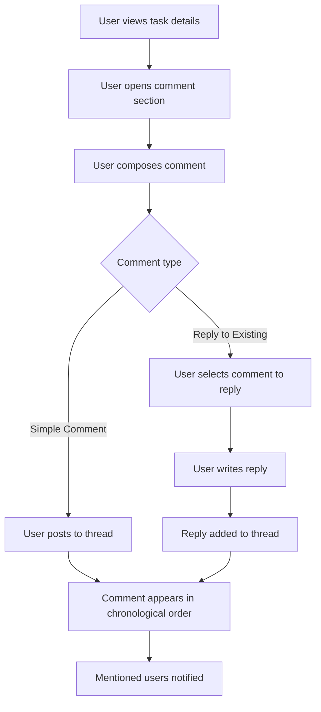

1. User views task details
2. User navigates to the comment section
3. For new comments:
   - User composes comment text (supports Markdown)
   - User can @mention other users
   - User posts comment to thread
4. For replies:
   - User selects comment to reply to
   - User composes reply text
   - Reply is nested under original comment
5. All comments display:
   - Author information
   - Timestamp
   - Formatted content
   - Like/reaction options
6. Mentioned users receive notifications

## 6. Integration with Flowchart

### 6.1 Linking Tasks to Flowchart Nodes

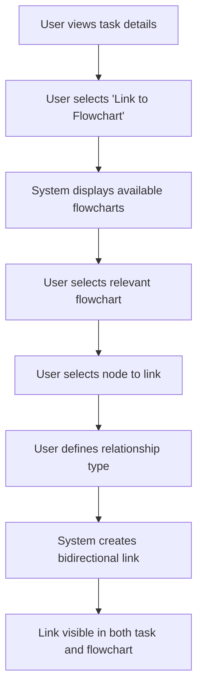

1. From task details, user selects "Link to Flowchart"
2. System displays available flowcharts
3. User selects relevant flowchart
4. User selects specific node to link with task
5. User defines relationship type (implements, blocks, relates)
6. System creates bidirectional link between task and node
7. Link is visible in both task details and flowchart view

### 6.2 Navigating Between Task and Flowchart

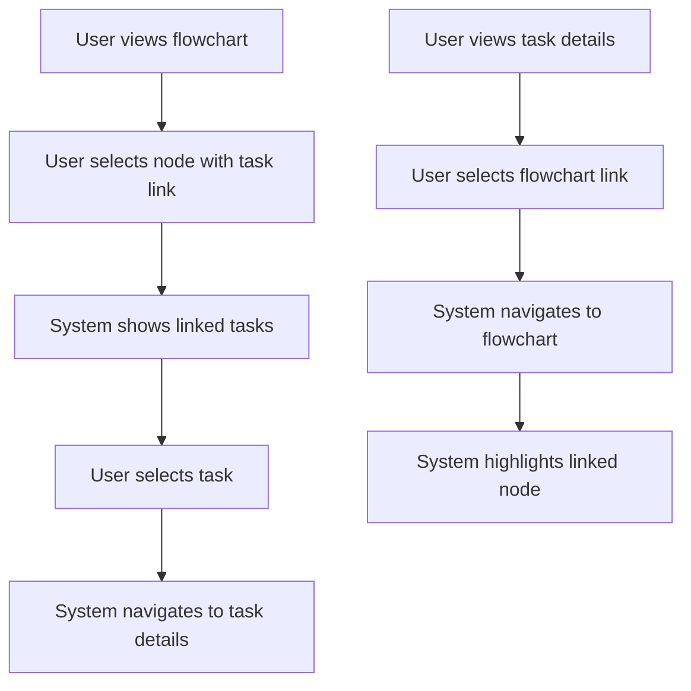

1. From flowchart view:
   - User selects node with task links
   - System shows linked tasks
   - User selects task to view details
   - System navigates to task details
2. From task details:
   - User selects flowchart link
   - System navigates to flowchart view
   - System highlights the linked node

## 7. Edge Cases and Error Handling

### 7.1 Task Creation Failures

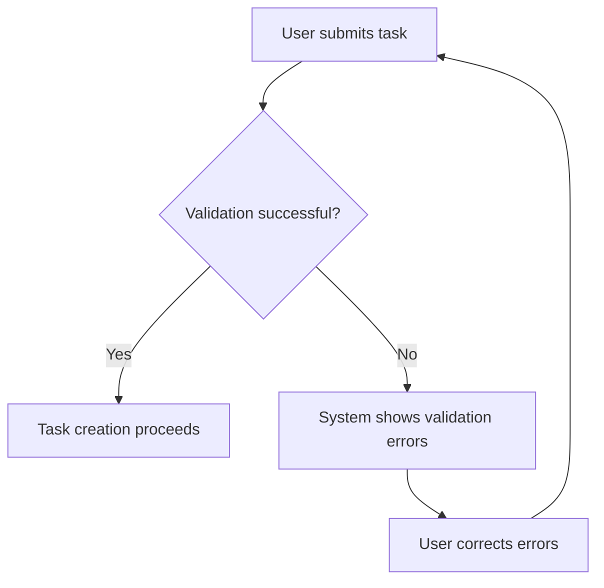

1. User submits task with invalid data
2. System performs validation
3. Validation errors are displayed inline
4. User corrects errors and resubmits
5. If submission fails due to connection:
   - Task is saved locally
   - System retries when connection restored
   - User is notified of temporary local storage

### 7.2 Voting Conflicts

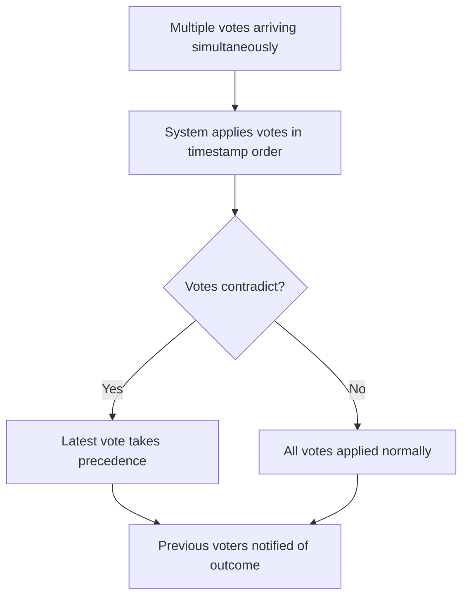

1. When multiple votes arrive simultaneously:
   - System applies votes in timestamp order
   - Latest vote from each member takes precedence
   - Previous voters are notified if outcome changes
2. If consensus threshold changes during voting:
   - System recalculates based on new threshold
   - Users are notified of changed requirements

### 7.3 Task Sync Issues

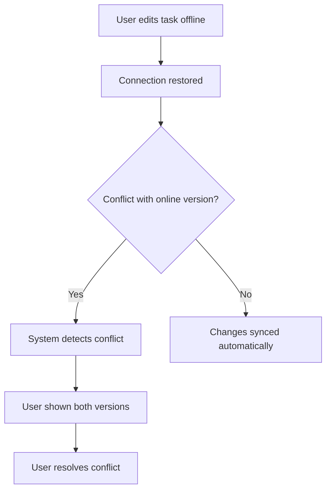

1. User edits task while offline
2. When connection is restored:
   - System detects if conflicts exist
   - If no conflicts, changes sync automatically
3. If conflicts are detected:
   - User is shown both versions
   - User can choose which version to keep
   - Resolution is recorded in activity log

## 8. Notifications Flow

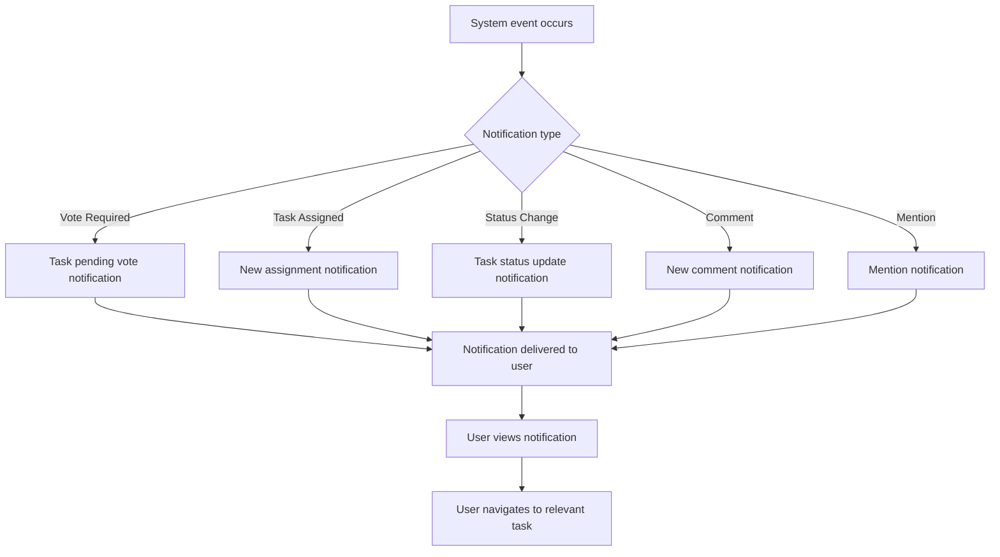

1. System events trigger notifications:
   - Vote required on task
   - Task assigned to user
   - Task status changed
   - New comment added
   - User mentioned in comment
2. Notifications are delivered based on user preferences
3. User views notification
4. User can click notification to navigate directly to the relevant task

## 9. User Onboarding Flow

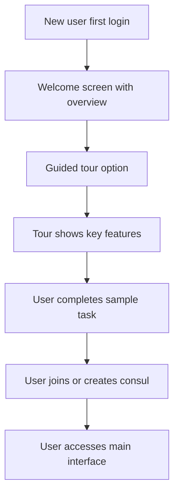

1. First-time users see welcome screen with overview
2. User is offered guided tour option
3. Tour highlights key features:
   - Task creation
   - Voting process
   - Comment system
   - Flowchart integration
4. User completes sample task for hands-on experience
5. User is guided to join existing consul or create new one
6. User transitions to main interface with helpful tooltips 